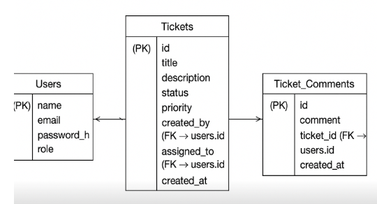
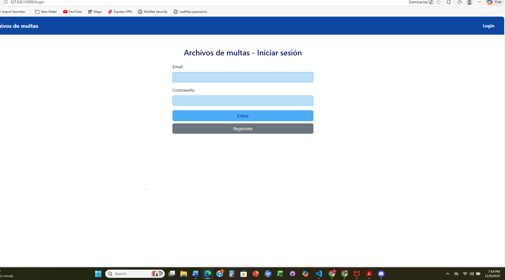
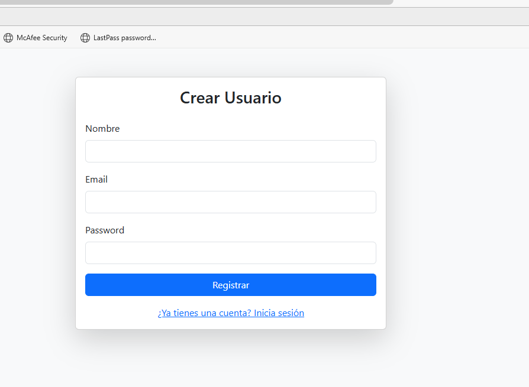
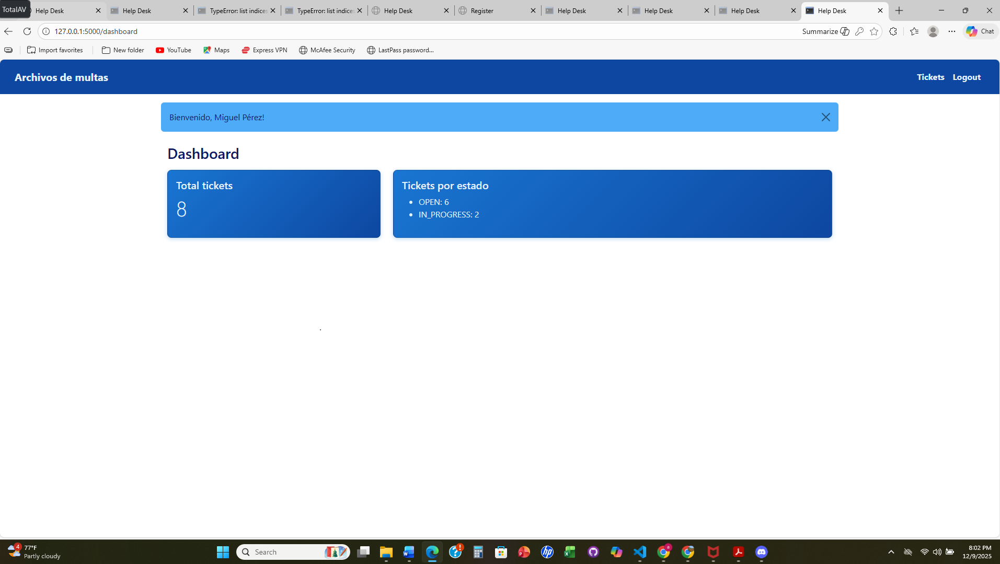
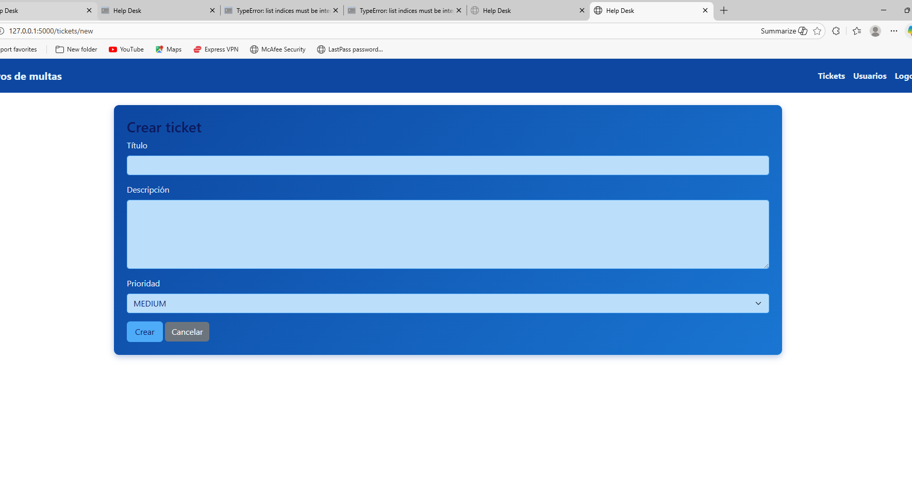
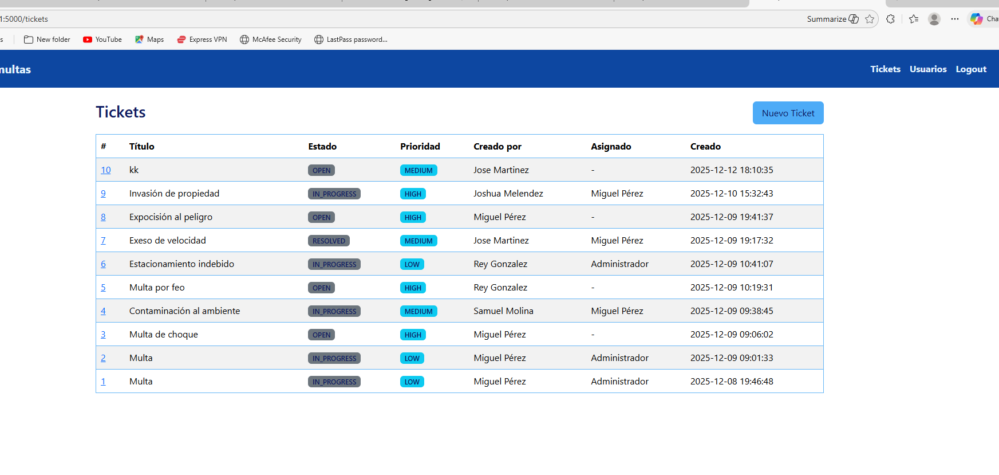
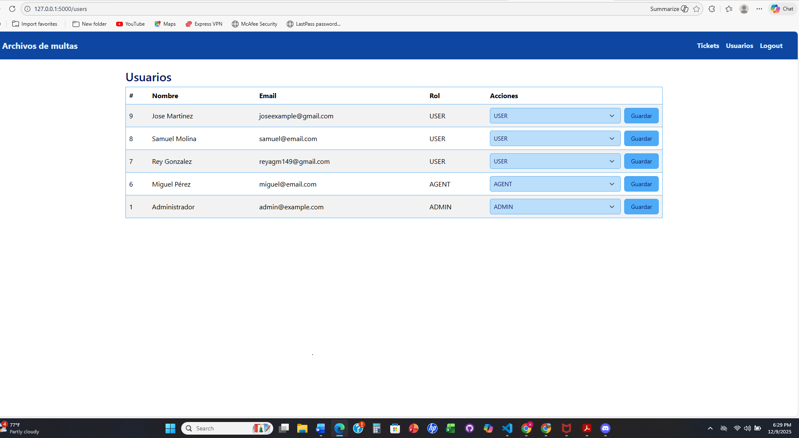

# Manual Técnico

## 1. Descripción del Proyecto

El presente proyecto corresponde a una aplicación **Full Stack tipo Help Desk**, desarrollada como proyecto final del curso de Full Stack. El sistema permite la gestión de tickets de soporte, control de usuarios y manejo de roles, facilitando la comunicación entre usuarios finales y administradores.

**Objetivo principal:**
Permitir que los usuarios creen tickets de soporte y que los administradores puedan gestionarlos, asignarlos, dar seguimiento y resolverlos.

---

## 2. Tecnologías  que son utilizadas

* **Backend:** Python, Flask
* **Frontend:** HTML, CSS, Bootstrap
* **Base de Datos:** MySQL / MariaDB
* **ORM:** SQLAlchemy
* **Autenticación:** Flask-Login
* **Control de Roles:** Flask-Principal
* **Herramientas:** Visual Studio Code, Git, GitHub

---

## 3. Arquitectura del Proyecto

El proyecto sigue una arquitectura MVC (Modelo – Vista – Controlador) simplificada, donde Flask actúa como controlador principal.

### 3.1 Estructura de Carpetas

Proyecto-final-de-fullstack/
│
├─ app.py # Archivo principal de la aplicación
├─ config.py # Configuración del proyecto
├─ models.py # Modelos de base de datos
├─ routes.py # Rutas y vistas
├─ requirements.txt # Dependencias del proyecto
│
├─ templates/ # Plantillas HTML
├─ static/ # CSS, JS e imágenes
├─ docs/ # Documentación
│ ├─ manual_tecnico.md
│ ├─ manual_usuario.md
│ ├─ er_diagram.png
│ └─ screenshots/
└─ venv/ # Entorno virtual (no incluido en GitHub)

---

## 4. Base de Datos

### 4.1 Diagrama Entidad–Relación (ER)

El sistema está compuesto por las entidades principales **Users**, **Tickets** y **Ticket_Comments**, las cuales se relacionan entre sí para permitir la gestión completa del sistema.

---

### 4.2 Descripción de Tablas

#### Tabla: users

* id (PK)
* name
* email
* password_hash
* role

**Descripción:**
Almacena la información de los usuarios registrados en el sistema y su rol correspondiente.

---

#### Tabla: tickets

* id (PK)
* title
* description
* status
* priority
* created_by (FK → users.id)
* assigned_to (FK → users.id)
* created_at

**Descripción:**
Registra los tickets creados por los usuarios y su estado dentro del sistema.

---

#### Tabla: ticket_comments

* id (PK)
* comment
* ticket_id (FK → tickets.id)
* user_id (FK → users.id)
* created_at

**Descripción:**
Permite el seguimiento de los tickets mediante comentarios asociados.

---

## 5. Funcionalidades del Sistema

### 5.1 Autenticación

* Registro de usuarios
* Inicio de sesión
* Cierre de sesión
* Protección de rutas mediante roles

---

### 5.2 Dashboard

Una vez autenticado, el usuario accede al panel principal desde donde puede navegar a las funcionalidades disponibles según su rol.

---

### 5.3 Gestión de Tickets

#### Listado de Tickets

Muestra todos los tickets disponibles según el rol del usuario.

---

#### Detalle del Ticket

Permite visualizar la información completa del ticket, agregar comentarios y actualizar su estado.

 

---

### 5.4 Gestión de Usuarios

Funcionalidad exclusiva del rol Administrador. Permite visualizar usuarios y asignar roles.

---

## 6. Roles y Permisos

* **Admin:** Gestión total del sistema, usuarios y tickets.
* **Agente/Bibliotecario:** Gestión y seguimiento de tickets asignados.
* **Usuario/Lector:** Creación y seguimiento de sus propios tickets.

---

## 7. Seguridad

* Contraseñas almacenadas usando hash
* Validación de formularios
* Protección de rutas según roles
* Control de acceso mediante Flask-Login

---

## 8. Dependencias 

Las dependencias del proyecto se encuentran en el archivo `requirements.txt`, entre las más importantes:

* Flask
* Flask-Login
* Flask-Principal
* Flask-SQLAlchemy
* Werkzeug

---

## 9. Configuración del Proyecto

1. Crear y activar entorno virtual
2. Instalar dependencias con `pip install -r requirements.txt`
3. Configurar variables de entorno
4. Crear base de datos
5. Ejecutar la aplicación con `python app.py`

---

